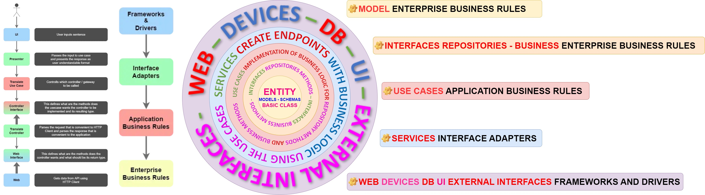

# https://emojipedia.org
# https://gist.github.com/rxaviers/7360908
Repository with projects especially focused on Computer Science and Natural Sciences.


# 🐍 SCAFFOLDING FOR CLEAN ARCHITECTURE IN MICROSERVICES

```
📦jorge_cardona_project [project_directory]
┗ 📂deployment [package]
┗ 📂requirements [package]
┗ 📂test [package]
┗ 📜 README.md
┗ ⚠️ .gitignore
┗ 📂application [package]
┃ ┣ 📂configuration
┃ ┣ 📂log
┃ ┣ 📂htmlcov
┃ ┣ 📂utils
┃ ┣ 📂domain [package]
┃ ┃ ┣ 📂models [package]
┃ ┃ ┣ 📂interfaces [package]
┃ ┃ ┃ ┗ 📂repositories [package]
┃ ┃ ┃ ┗ 📂business [package]
┃ ┃ ┣ 📂usecases [package]
┃ ┃ ┣ 📂services [package]
┃ ┣ main.py [__main__]
```

# PROJECT PACKAGES STRUCTURE
```
📦jorge_cardona_project [project_directory]
┗ 📂application [package]
┃ ┣ 🎄 main.py [__main__]
┃ ┣ 📂configuration
┃ ┣ ┗ 🏩 app_configuration.py
┃ ┣ ┗ 📡 environment_configuration.py
┃ ┣ ┗ 🔑 database_configuration.py
┃ ┣ ┗ 📜 log_configuration.py
┃ ┣ ┗ 🚧 cors_configuration.py
┃ ┣ ┗ 📪 swagger_configuration.py
┃ ┣ 📂log
┃ ┣ ┗ 💬 logging.log
┃ ┣ 📂htmlcov
┃ ┣ ┗ 📜 main_py.html
┃ ┣ 📂utils
┃ ┣ ┗ 🐍 script.py
┃ ┣ ┗ 🎰 file.yaml
┃ ┣ ┗ 📜 image.jpg
┃ ┣ 📂domain [package]
┃ ┃ ┣ 📂models [package]
┃ ┃ ┃ ┣ 📂entity_one
┃ ┃ ┃ ┃ ┗ 🐔 Model_ONE.py
┃ ┃ ┃ ┃ ┗ 🐤 Schema_ONE.py
┃ ┃ ┃ ┣ 📂entity_two
┃ ┃ ┃ ┃ ┗ 🐔 Model_TWO.py
┃ ┃ ┃ ┃ ┗ 🐤 Schema_TWO.py
┃ ┃ ┃ ┣ 📂entity_n
┃ ┃ ┃ ┃ ┗ 🐔 Model_N.py
┃ ┃ ┃ ┃ ┗ 🐤 Schema_N.py
┃ ┃ ┣ 📂interfaces [package]
┃ ┃ ┃ ┗ 📂repositories [package]
┃ ┃ ┃ ┃ ┣ 📂repository_model_one
┃ ┃ ┃ ┃ ┃ ┗ 🐟 database_method_model_Entity_ONE.py
┃ ┃ ┃ ┃ ┣ 📂repository_model_two
┃ ┃ ┃ ┃ ┃ ┗ 🐟 database_method_model_Entity_TWO.py
┃ ┃ ┃ ┃ ┣ 📂repository_model_n
┃ ┃ ┃ ┃ ┃ ┗ 🐟 database_method_model_Entity_N.py
┃ ┃ ┃ ┗ 📂business [package]
┃ ┃ ┃ ┃ ┣ 📂business_model_one
┃ ┃ ┃ ┃ ┃ ┗ 🐦 business_method_model_Entity_ONE.py
┃ ┃ ┃ ┃ ┣ 📂business_model_two
┃ ┃ ┃ ┃ ┃ ┗ 🐦 business_method_model_Entity_TWO.py
┃ ┃ ┃ ┃ ┣ 📂business_model_n
┃ ┃ ┃ ┃ ┃ ┗ 🐦 business_method_model_Entity_N.py
┃ ┃ ┣ 📂usecases [package]
┃ ┃ ┃ ┣ 📂usecase_model_one
┃ ┃ ┃ ┃ ┗ 🎎 use_case_implementation_business_repository_logic_model_ONE.py
┃ ┃ ┃ ┣ 📂usecase_model_two
┃ ┃ ┃ ┃ ┗ 🎎 use_case_implementation_business_repository_logic_model_TWO.py
┃ ┃ ┃ ┣ 📂usecase_model_n
┃ ┃ ┃ ┃ ┗ 🎎 use_case_implementation_business_repository_logic_model_N.py
┃ ┃ ┣ 📂services [package]
┃ ┃ ┃ ┣ 📂service_model_one
┃ ┃ ┃ ┃ ┗ ✈️ services_use_case_implementation_model_ONE.py
┃ ┃ ┃ ┣ 📂service_model_two
┃ ┃ ┃ ┃ ┗ ✈️ services_use_case_implementation_model_TWO.py
┃ ┃ ┃ ┣ 📂service_model_n
┃ ┃ ┃ ┃ ┗ ✈️ services_use_case_implementation_model_N.py
┗ 📂deployment [package]
┃ ┗ 🐳 Dockerfile
┃ ┗ 🎰 Manifest.yaml
┗ 📂requirements [package]
┃ ┗ 📄 requirements.txt
┗ 📂test [package]
┃ ┃ ┣ 📂test_case_one
┃ ┃ ┃ ┗ 🍄 use_case_implementation_one.py
┃ ┃ ┃ ┗ 🍄 services_use_case_implementation_one.py
┃ ┃ ┣ 📂test_case_two
┃ ┃ ┃ ┗ 🍄 use_case_implementation_two.py
┃ ┃ ┃ ┗ 🍄 services_use_case_implementation_two.py
┃ ┃ ┣ 📂test_case_n
┃ ┃ ┃ ┗ 🍄 use_case_implementation_n.py
┃ ┃ ┃ ┗ 🍄 services_use_case_implementation_n.py
┗ 📜 README.md
┗ ⚠️ .gitignore
```

# Application
Directory that contains the packages with the application code.

# Configuration
Contains all configuration files for the Application

```
# fast_api_configuration.py

from fastapi import FastAPI
from fastapi.openapi.utils import get_openapi
from ..cors.cross_origin_config import CORSMiddleware, origins 

clean_architecture = FastAPI()

def custom_openapi():
    if clean_architecture.openapi_schema:
        return clean_architecture.openapi_schema
        
    openapi_schema = get_openapi(
        title="Clean Architecture Api Documentation",
        version="1.0.1",
        terms_of_service="http://example.com/terms/",
        description="Documentation for my custom OpenAPI schema",
            contact={
        "name": "Jorge Cardona",
        "url": "https://github.com/JorgeCardona/portfolio",
        "email": "jorgecardona@utp.edu.co",
    },
    license_info={
        "name": "Apache 2.0",
        "url": "https://www.apache.org/licenses/LICENSE-2.0.html",
    },
    
        routes=clean_architecture.routes,
    )
    openapi_schema["info"]["x-logo"] = {
        "url": "https://fastapi.tiangolo.com/img/logo-margin/logo-teal.png"
    }

    clean_architecture.openapi_schema = openapi_schema

    return clean_architecture.openapi_schema

# SWAGGER CONFIG
clean_architecture.openapi = custom_openapi

# CORS CONFIG
clean_architecture.add_middleware(
    CORSMiddleware,
    allow_origins=origins,
    allow_credentials=True,
    allow_methods=["*"],
    allow_headers=["*"],
)
```

```
# logging.py

import logging as log_api
import os

ROOT_DIRECTORY = str(os.getcwd()).replace('\\','/')
LOG_FILE_NAME  = 'logging.log'
LOG_FOLDER = ROOT_DIRECTORY + '/log'
LOG_DIRECTORY = LOG_FOLDER  + '/' + LOG_FILE_NAME

format_log = '%(asctime)s | %(levelname)s | message = %(message)s | %(name)s | line %(lineno)d | package %(filename)s | %(funcName)s'
log_api.basicConfig(filename=LOG_DIRECTORY,
                    level=log_api.DEBUG,
                    format= format_log)
```

```
# env.py

import os
from sqlalchemy import create_engine
from sqlalchemy.ext.declarative import declarative_base
from sqlalchemy.orm import sessionmaker

class Environment:
    
    Base =  declarative_base()
         
    def __init__(self, environment:str) -> None:
        self.engine = self.select_environment(environment)
        self.session_local = sessionmaker(bind=self.engine, expire_on_commit=False)
        # since the function returns nothing then you don't need parentheses when assigning the variable to a function
        self.get_sessiones = self.get_session
        
     
    def select_environment(self, environment:str) -> None:
        
        if environment == 'dev':
            return self.get_engine_dev()            
        else:
            return self.get_engine()
    

    def create_engine(self, SQLALCHEMY_DATABASE_URL:str):
            
        #Creates database engine
        engine = create_engine(
            SQLALCHEMY_DATABASE_URL,
            connect_args={"check_same_thread": False},
            echo =True,
            pool_recycle=3600
        )
        
        return engine
               
    def get_engine_dev(self):

        #Define database values
        DATABASE_NAME = 'clean_architecture.db'
        DIRECTORY_SAVE_SQLITE_DATABASE = 'configuration/database/sqlite_test'
        SQLALCHEMY_DATABASE_URL = f"sqlite:///{DIRECTORY_SAVE_SQLITE_DATABASE}/{DATABASE_NAME}"

        return self.create_engine(SQLALCHEMY_DATABASE_URL)

        
    def get_engine(self):

        # environment variables

        dialect = os.environ["DB_DIALECT"]
        user = os.environ["DB_USER"]
        password = os.environ["DB_PASSWORD"]
        host = os.environ["DB_HOST"]
        port = os.environ["DB_PORT"]
        database = os.environ["DB_NAME"]
    
        # create url connection to database
        SQLALCHEMY_DATABASE_URL = "{DB_DIALECT}://{DB_USER}:{DB_PASSWORD}@{DB_HOST}:{DB_PORT}/{DB_NAME}" \
                                  .format(DB_DIALECT=dialect, DB_USER=user, DB_PASSWORD=password, \
                                          DB_HOST=host, DB_PORT=port, DB_NAME=database)

        return self.create_engine(SQLALCHEMY_DATABASE_URL)
    
    def get_session(self):
        
        # esta relacionado con la variable definida al inicio de la clase
        self.Base.metadata.create_all(self.engine)
        
        SessionLocal = sessionmaker(bind=self.engine, expire_on_commit=False)
        
        session = SessionLocal()
        try:
            yield session
        finally:
            session.close()
```

```
# db_config.py

import os
from sqlalchemy import create_engine
from sqlalchemy.ext.declarative import declarative_base
from sqlalchemy.orm import sessionmaker
from ..environment.env import Environment

instance = Environment('dev')
get_session = instance.get_session
```

# Log
Save information about the application log.

# htmlcov
Save unit testing coverage information about the application code.

# Utils
Contains transversal resources for the application, that is not possible to include in other layers.

# Entities
is a package that contains modules, like Models and Schemas, the module it's a plain script, it contains only the class definition and no logic in the classes.
- **Models**: are modules that contain the fields from a table on the database and it is represented by a class.
```
# model_product.py

from sqlalchemy import Column, Integer, String
from pydantic import BaseModel

class ProductIn(BaseModel):
    __tablename__ = 'products'

    id = Column(Integer, primary_key=True)
    name = Column(String(256))
    categorie = Column(String(256))
    price = Column(Integer)
```

- **Schemas**: these are modules that contain the fields Used to validate data we receive as well as to reformat the data that we want to send to the client/browser, so just contains the fields that we want to return in the request. and every field is declared **KEY:VALUE**
```
# schema_product.py
class ProductOut(BaseModel):

    name: str
    categorie: str
    price: int
```


# Interfaces
are interfaces that contain only the methods that need to be implemented in the use cases one directory by class.
- **Repository**: Contains modules with methods that are needed to communicate with the database by class.
```
# repository_product.py

from abc import ABC, abstractmethod
from typing import List
from fastapi import Depends
from sqlalchemy.orm import Session
from domain.entities.schemas.schema_product import ProductIn as complete_schema
from configuration.database.db_config import get_session

class ProductRepository(ABC):

    @abstractmethod
    def getObjectList(self, session:Session = Depends(get_session), offset: int = 0, limit: int = 100):
        pass

    @abstractmethod
    def addObject(self, entity:complete_schema, session:Session = Depends(get_session)):
        pass
```

- **Business**: Contains modules with methods that are needed to process the information by class.

```
# business_product.py

from abc import ABC, abstractmethod
from fastapi import Depends
from sqlalchemy.orm import Session
from domain.entities.schemas.schema_product import ProductIn as complete_schema
from configuration.database.db_config import get_session

class ProductBussines(ABC):

    @abstractmethod
    def addTax(self, value:float):
        pass
```


# Use Cases
is a package that contains modules, the module is a class that implements the methods from the package interfaces(Repository, Business) and defines the business logic by module.


```
# usecase_product.py
class ProductUseCases(ProductRepository, ProductBussines):
     
    def getObjectList(self, session:Session = Depends(get_session), offset: int = 0, limit: int = 100):
       
        object_ = session.query(model).offset(offset).limit(limit).all()
        return object_
    
            
    def addObject(self, entity:complete_schema, session:Session = Depends(get_session)):

        object_data = entity.dict(exclude_unset=True)
        object_data['price'] = self.calculateTax(object_data['price'])
        object_ = model(**object_data)
        
        session.add(object_)
        session.commit()
        session.refresh(object_)
        return object_

    def addTax(self, value:float):
        
        return value * 1.19
```


# Services
is a package that contains modules, the module is a class that contains the API services by functionality or by class and use the UseCases classes.

```
# service_product.py

from configuration.fastapi.fast_api_configuration import clean_architecture
from configuration.database.db_config import get_session
from domain.entities.schemas.schema_product import ProductComplete as complete_schema
from domain.entities.schemas.schema_product import ProductPatch as patch_schema
from usescases.usecase_product import ProductUseCases as useCase

class ProductServices:
        
    @clean_architecture.get("/")
    def Product_List(session: Session = Depends(get_session), offset: int = 0, limit: int = 100):
        return useCase().getObjectList(session=session, offset=offset, limit=limit)

    @clean_architecture.post("/", status_code=status.HTTP_201_CREATED)
    def Single_Product(entity:complete_schema, session: Session = Depends(get_session)):
        return useCase().addObject(entity=entity, session=session)
```

# Main.py

```
from configuration.fastapi.fast_api_configuration import clean_architecture
from services.service_product import ProductServices
```
# run application

```
uvicorn main:clean_architecture --host localhost --reload --port 5555
```


# Web, Devices, DB, UI, External Interfaces
layer that communicates internal API services with API consumers.

# Deployment
Directory that contains the Dockerfile, k8s Manifest, and every file needed for the deployment.

# Requirements
Directory containing the requirements.txt with the definition of project dependencies.

# Test
Directory that contains the unit testing from the Use Cases and Services files.